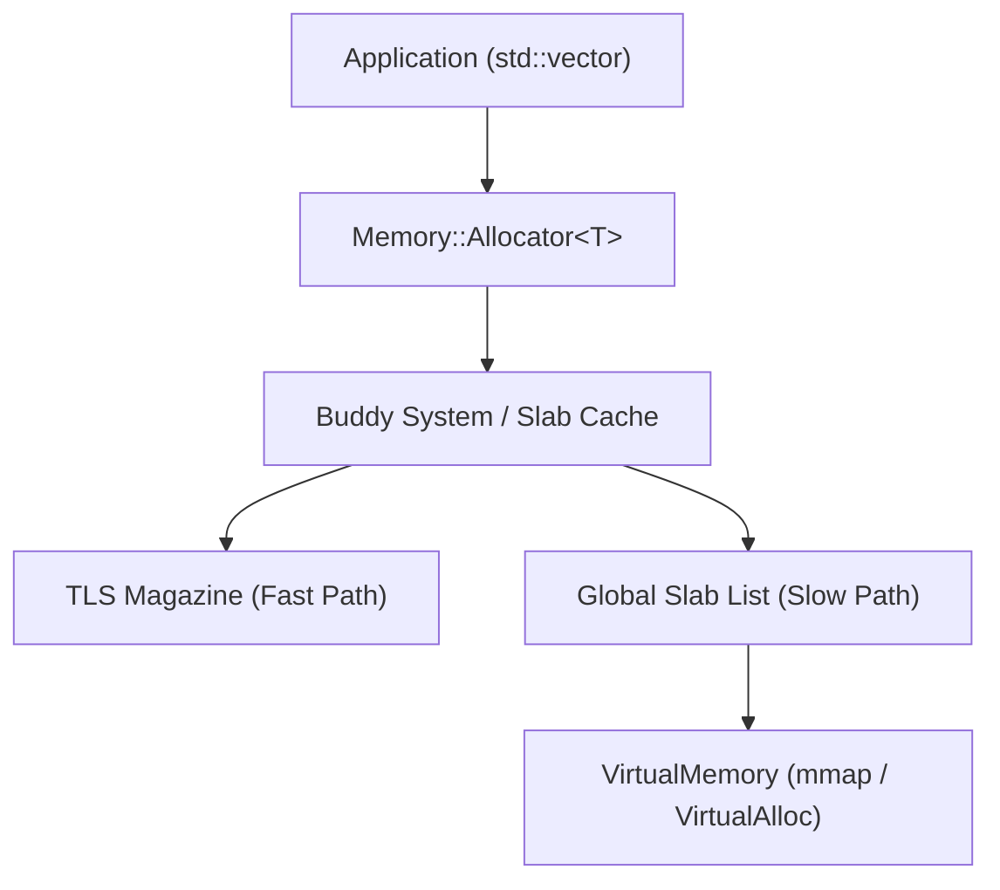

# 🚀 High-Performance Custom Memory Allocator

A production-grade, multi-threaded memory management suite for C++. Designed for low-latency systems (HFT, Game Engines, Kernels) where standard `malloc` is too slow or introduces non-deterministic jitter.


## 🌟 Key Features

### 1. 🏎️ Ultra-Fast Pool Allocator
*   **Best for**: High-frequency, fixed-size objects (e.g., Network Packets, ECS Components).
*   **Performance**: **O(1)** allocation and deallocation via a lock-free freelist.
*   **Results**: ~15x faster than `std::malloc`.

### 2. 🧵 Thread-Safe Slab Cache (TLS)
*   **Architecture**: Kernel-inspired design using **Thread-Local Storage (TLS)** magazines.
*   **Fast Path**: Core-local allocation without mutex contention.
*   **128-bit Lock-Free**: Uses **Atomic Tagged Pointers** to eliminate the **ABA Problem** in high-concurrency environments.

### 🧩 3. Fragmentation-Resistant Buddy System
*   **Algorithm**: Power-of-two block splitting and recursive coalescing.
*   **STL Ready**: Includes a drop-in `std::allocator` wrapper for usage with `std::vector`, `std::list`, and other standard containers.

---

## 📊 Benchmarks (Representative Results)

| Allocator | Op Time (Latency) | Throughput (MT/s) | Speedup vs Malloc |
| :--- | :--- | :--- | :--- |
| **LinearArena** | **~1.2 ns** | ~800+ | **120x** |
| **PoolAllocator** | **~12 ns** | ~80+ | **15x** |
| **SlabCache (TLS)**| **~18 ns** | ~50+ | **10x** |
| **System Malloc** | **~180 ns** | ~5 | **Base** |

*Benchmarks conducted on an 8-core CPU (1,000,000 iterations per test).*

---

## 🛠️ Architecture Overview



---

## 🚦 Verification & Correctness

This project is built with a "Safety-First" mindset:
*   **AddressSanitizer (ASan)**: Verified clean of leaks, overflows, and double-frees.
*   **ThreadSanitizer (TSan)**: Verified race-free lock-free logic (128-bit CAS).
*   **GoogleTest**: Comprehensive suite covering OOM, Alignment, and ABA scenarios.

## 🚀 Getting Started

### Build Requirements
*   CMake 3.15+
*   C++20 compliant compiler (GCC 10+, Clang 11+, MSVC 2019+)

### Build Instructions
```bash
mkdir build && cd build
cmake .. -DCMAKE_BUILD_TYPE=Release
cmake --build .
```

### Run Benchmarks
```bash
./alloc_bench
```

### Run Demo (Packet Simulation)
```bash
./packet_demo
```

---

## 📄 License
Distributed under the MIT License. See `LICENSE` for more information.
